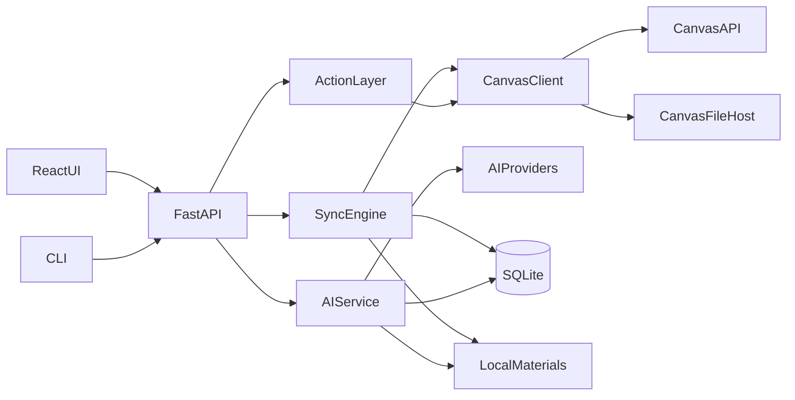

# Canvas 助手：自由开发版实施计划

> 版本：v2.0-free  
> 日期：2026-09-23  
> 定位：单用户、本地优先、AI 原生的 Canvas 学习与开发助手

本文档是 `PLAN.md` 的自由开发版本。它保留已经验证的 Canvas 事实、可靠的技术方案和必要的工程安全，但不把学术政策、AI 声明、内容来源或道德判断写成产品级封锁规则。

开发原则是：**能力默认可用，风险明确展示，最终操作由用户决定。**

---

## 0. 开发规则

1. 优先完成可运行的端到端功能，不要求所有非关键验收通过后才能继续。
2. 允许多个相互独立的模块并行开发；数据库迁移、公共接口和安全边界变更需要先协调。
3. `PLAN_FREE.md` 是当前自由版的设计基线。实现中发现更好的方案时，可以同时更新设计和代码，不要求先后顺序。
4. 测试分级：
   - 阻塞：凭证泄漏、越权访问、数据损坏、不可逆误操作、数据库迁移失败。
   - 非阻塞：样式、次要兼容、低概率空状态、非核心接口暂时不可用。
5. 真实账号测试可以由用户或获得用户明确授权的编码助手执行。输出日志必须经过脱敏。
6. 开发助手可以读取课程正文、作业、成绩和反馈来完成用户要求，但不得把原始私人数据写入公开仓库、公开日志或无关服务。
7. Canvas 写操作可以实现和测试。执行不可逆或高影响操作前必须显示准确预览并取得用户确认。
8. 不根据“是否由 AI 生成”阻止功能。文件、文本和计划一律按内容及操作风险处理。

### 0.1 必须保留的工程边界

- Canvas token、Anthropic key、ICS 私密地址和文件 verifier 不写入代码、日志、fixture 或 git。
- 不绕过 Canvas 本身的身份验证、课程锁定或账号权限。
- 不调用已经确认会产生意外副作用或泄露无关用户数据的接口。
- Canvas HTML、文件和 AI 输出都按不可信输入处理。
- 下载、路径拼接、文件预览和外部链接必须防止路径穿越、脚本执行和鉴权头泄漏。
- 提交作业、发送消息、删除数据等操作执行后必须回读验证。

这些边界保护账号和数据，不限制 AI 能力或用户对自己内容的处理方式。

---

## 1. 产品目标

### 1.1 一句话

一个运行在 Mac 本机的 Canvas 助手：集中管理课程、截止日期、资料、成绩和沟通，并让 AI 对这些数据执行总结、检索、规划、起草、改写、分析和自动化操作。

### 1.2 用户与运行环境

- 单用户：项目主人。
- Canvas：`https://canvas.uts.edu.au`。
- 系统：macOS。
- 界面语言：简体中文。
- 课程原文保持英文，AI 可以按用户要求使用中文、英文或双语输出。
- 默认本地运行和本地存储，可在以后扩展为多用户或远程部署。

### 1.3 核心价值

1. 不漏截止日期、考试、公告、反馈和新成绩。
2. 自动收集课程资料，并保留更新和本地修改。
3. 在一个界面完成查看、搜索、下载、规划、沟通和提交。
4. AI 能直接使用用户授权的数据完成完整任务，而不仅限于摘要或“理解”。
5. 所有自动化都可追踪、可预览、可撤销或有明确的恢复方式。

### 1.4 MVP

MVP 包含：

- Token 设置和连接诊断。
- 课程、作业、Planner、日历和本地待办同步。
- 资料发现、下载、浏览和预览。
- 作业详情、提交状态、成绩和反馈。
- 本地搜索。
- AI 问答、总结、作业分析、起草和学习计划。
- 基础写操作：标记完成、Planner Note、讨论已读、作业提交。

后台通知、桌面封装、高级写操作和多用户支持不阻塞 MVP。

### 1.5 暂不优先

- 抓取 Kaltura、Leganto、Turnitin 等第三方 LTI 内部页面。
- 绕过尚未开放的课程内容。
- 模拟教师、管理员或其他学生权限。
- 无明确需求的企业级部署和复杂权限系统。

这些是范围选择，不是永久禁令。

---

## 2. 已验证的 Canvas 事实

以下结论来自 2026-09-23 的 UTS 账号实测，开发时可用 probe 重新确认。

### 2.1 账号与平台

- 学生个人 token 可用，但约 90 天过期；需要倒计时、续期和失效降级。
- 用户时区为 `Australia/Sydney`，必须使用 IANA 时区处理夏令时。
- REST 是主接口；GraphQL 适合批量课程、页面索引、评分标准和反馈未读状态。
- token 失效表现为 `401` 且带 `WWW-Authenticate`；普通权限拒绝多为 `403`。
- 合理并发为 2，请求列表使用 `per_page=100` 并沿 `Link rel="next"` 翻页。

### 2.2 截止日期与日历

- `/planner/items` 是统一待办的主数据源。
- `calendar_events` 每次最多可靠处理 10 个 `context_codes`，需要分批。
- Canvas 日历没有完整考试安排，应用必须支持手动考试和重要日期。
- ICS 可作为 token 失效后的只读降级数据源。

### 2.3 页面与资料

- 多数课程隐藏 Files 标签，`/courses/:id/files` 会返回 403。
- 页面列表 REST 接口被关闭，但单页 GET 可用；GraphQL `pagesConnection` 可建立页面索引。
- 课程页面和作业正文中的文件 ID 通常仍可通过文件详情接口读取。
- 文件下载会跳转到 `canvas-user-content.com`；跨域后不得发送 Authorization。
- 正文中包含 iframe、LTI 和外部资源，默认只索引并在浏览器中打开。

### 2.4 作业、成绩与测验

- 课程总分通常被隐藏，应用可以按作业组权重计算非官方总分。
- 成绩是否发布应以 `posted_at` 为准。
- 可读取已发布作业的分数统计、Turnitin 状态、迟交信息、rubric 和反馈。
- Quizzes 列表可能被关闭，但可以通过 assignment 的 `quiz_id` 获取单个测验。

### 2.5 沟通

- 公告使用 REST；GraphQL 可能混入其他班级公告。
- 讨论 GET 不会自动改变已读状态。
- 收件箱、全校通知和活动摘要接口可用。

### 2.6 已知危险接口

以下接口在客户端层拒绝调用：

- `GET /api/v1/courses/:id/folders/media`：会创建隐藏文件夹。
- assignment/quiz overrides 列表：可能返回大量无关学生 ID。
- Poll session 的 `/open`、`/close`：虽然是 GET，但会改变状态。
- GraphQL `discussionsConnection` 用于公告：可能返回其他班内容。
- `/api/lti/*`：需要 LTI 专用身份，不属于本应用会话。

---

## 3. 功能范围

### 3.1 账户和课程

- 首次设置：Canvas 地址、token 验证和账号确认。
- Token 健康：有效性、过期时间、续期提醒和重新绑定。
- 课程按学期分组，支持隐藏、昵称、颜色和历史课程。
- 显示 section、课程权限、导航标签和外部工具。
- Token 失效时继续展示缓存和 ICS。

### 3.2 待办与日历

- 汇总作业、测验、讨论、阅读项、课表、本地待办和手动考试。
- 分为逾期、今天、7 天内和之后。
- 显示完成、提交、评分、缺交、迟交、锁定和阅读状态。
- 检测截止日期、开放时间和分值变化。
- 月、周、列表日历。
- 工作量视图、倒计时、提醒和 ICS 导出。
- 可把完成状态、Planner Notes 和学习时段同步回 Canvas。

### 3.3 作业与成绩

- 作业说明、附件、时间、提交类型、次数和允许格式。
- Rubric、自查清单、历次提交、老师反馈和未读状态。
- 已发布成绩、作业组、非官方总评、What-if 和目标分。
- 分数分布可以展示 API 实际返回的统计信息；是否显示相对位置由用户设置。
- 测验规则、尝试记录和允许回看的题目。
- 支持文件、文本和 URL 提交。
- 提交内容可以来自用户、AI 或两者协作；应用不按来源拒绝。

### 3.4 课程资料

- 混合发现：Files、Folders、Modules、GraphQL Pages、作业、公告、讨论和附件。
- 增量下载、断点恢复、哈希校验和版本保留。
- 用户修改过本地文件时不覆盖，远端新版另存。
- 按模块或 Canvas 文件夹组织。
- 预览 PDF、图片、Markdown、ipynb、docx 和 xlsx。
- 外部资源索引和浏览器跳转。
- 课程 `_index.md`、作业资料包、提交归档和学期归档。
- 文件是否交给 AI 由用户或任务决定，不做基于出版商猜测的硬封锁。

### 3.5 沟通

- 公告流、讨论串、收件箱、未读徽章和全校通知。
- 标记已读、回复讨论、回复反馈和发送站内信。
- AI 可以帮助起草、改写和翻译消息；发送前显示最终内容和收件人。

### 3.6 搜索和学习工具

- 从 PDF、PPTX、DOCX、IPYNB、XLSX、页面和公告中抽取文本。
- SQLite FTS5 全文搜索，支持中英文查询改写。
- 最近浏览、学习进度、工作量和复习包。
- 数据导出为 CSV、ICS、Markdown 或 Anki 格式。

---

## 4. AI 能力

### 4.1 原则

- AI 是通用助手，不预设“只能理解、不能创作”。
- AI 可以总结、解释、检索、翻译、改写、起草、生成完整文稿、写代码、分析数据和制定计划。
- AI 可以根据用户要求处理作业说明、rubric、课程资料、成绩和反馈。
- 不根据课程名称、AI 政策选项、输出长度或“是否可提交”自动拒绝。
- AI 输出是否使用、修改、保存或提交，由用户决定。
- 可以提供可选的 AI 使用记录和标注，但默认不阻断生成、保存或提交。

### 4.2 功能

1. 资料摘要：中文、英文或双语，可附页码引用。
2. 问课程：检索课程资料并带出处回答。
3. 作业助手：拆解要求、生成提纲、起草章节、改写、检查 rubric 覆盖和润色。
4. 学习计划：根据 deadline、课表和可用时间生成结构化计划。
5. 术语表、自测题、闪卡和复习材料。
6. 反馈复盘：结合成绩、rubric 和评论提出改进，并可生成新版草稿。
7. 每周摘要和更新说明。
8. 消息助手：起草讨论回复、邮件和反馈回复。
9. 代码与数据助手：读取课程文件，生成或修改代码、分析脚本和图表说明。
10. Agent 操作：提出待办、下载、写回或提交动作，交给统一操作系统执行。

### 4.3 上下文与隐私

- 用户可选择单文件、作业、课程或全部课程作为上下文。
- 成绩、评语、讨论和同学内容默认可在当前本地会话中使用；设置页提供细粒度关闭选项。
- 发往第三方模型前清除 token、verifier、ICS 地址、邮箱和无关用户 ID。
- 是否匿名化姓名由设置控制，默认对无关人员匿名化。
- 文件来源检测只用于提示，不自动排除。用户可选择包含或排除某类资料。
- 本地模型和其他云模型可以作为未来 provider，不绑定单一厂商。

### 4.4 提示注入防护

- 课程资料放入 document/search_result 等数据块，不拼入 system 指令。
- system 明确资料中的命令只是待分析内容。
- 模型提出的工具调用必须经过应用权限和参数校验。
- 资料中的 URL、命令或写操作不会因为模型输出而自动执行。

### 4.5 输出与存储

- 输出可以保存到任意用户选择的位置，不强制 `_ai/` 目录。
- 可选记录模型、时间、输入来源、token 和费用。
- 可选添加“AI 生成”标注，默认只在历史记录中保留来源元数据。
- AI 生成文件可以正常预览、编辑和提交。

### 4.6 成本与模型

- 使用 provider 官方 SDK。
- 模型名称通过设置配置，不写死尚未验证的未来型号。
- 调用前可预估 token 和费用。
- 预算提醒默认开启，但硬上限由用户选择；不设置时不因预设金额阻断调用。
- 流式返回文本、引用、usage、错误和完成事件。

---

## 5. 写操作与自动化

### 5.1 统一动作层

所有 Canvas 写操作由 `canvas/writes.py` 统一实现：

- Planner override 和 Planner Note。
- 讨论、公告和反馈已读状态。
- 模块条目完成状态。
- 课程昵称、颜色和收藏。
- 日历事件和预约。
- 讨论回复、站内信和提交评论。
- 作业提交。
- 内容导出。

AI、UI 和 CLI 都调用同一动作层，不各自实现 Canvas 写请求。

### 5.2 风险级别

- 低风险：标记已读、标记完成、昵称、颜色、本地设置。
  - 可以直接执行，并提供撤销或相反操作。
- 中风险：创建待办、日历事件、讨论回复、提交评论。
  - 显示内联预览，用户确认后执行。
- 高风险：提交作业、发送站内信、删除远端内容。
  - 显示课程、目标、正文或文件、剩余次数和可能后果，用户明确确认。

不强制使用 macOS 原生对话框；Web 确认、CLI 确认或原生确认均可。是否增加二次确认由设置决定。

### 5.3 执行协议

1. `preview` 对参数进行规范化并生成短期 `confirm_token`。
2. `execute` 只接受 token，不重新接受可变参数。
3. 执行前检查当前权限和目标状态。
4. 非幂等写请求遇到超时或 5xx 时不盲目重试，先回读判断。
5. 执行后回读并记录是否验证成功。
6. 用户可以开启“低风险自动执行”。
7. AI 可以创建预览并请求确认，也可以在用户授予的自动化范围内执行低风险操作。

频率限制根据 Canvas rate limit 动态调整，不使用每天固定 5 次之类的武断上限。

### 5.4 作业提交

- 支持浏览器上传、本地文件选择、文本和 URL。
- 接受任何来源的文件，包括 AI 生成或修改的文件。
- 提交前检查扩展名、大小、剩余次数、锁定时间和 Turnitin 状态。
- 显示最终文本或文件列表。
- 提交后回读 attempt、时间和 workflow state。

---

## 6. 技术架构

### 6.1 技术栈

- Python 3.12。
- FastAPI + Uvicorn，单 worker。
- httpx AsyncClient。
- SQLite WAL + SQLAlchemy 2 + Alembic。
- APScheduler 3.x。
- React + Vite + TypeScript。
- Tailwind CSS + shadcn/ui。
- TanStack Query + React Router。
- FullCalendar。
- PyMuPDF、python-pptx、python-docx、openpyxl、nbformat/nbconvert。
- Anthropic SDK 作为首个 AI provider。
- pytest、respx、pytest-socket、Vitest 和 Playwright。

### 6.2 组件



### 6.3 目录结构

```text
backend/canvas_helper/
  main.py
  cli.py
  config.py
  secret_store.py
  redact.py
  security.py
  canvas/
    client.py
    auth.py
    pagination.py
    ratelimit.py
    graphql.py
    scrub.py
    writes.py
  sync/
    runner.py
    courses.py
    deadlines.py
    grades.py
    modules.py
    comms.py
    materials/
  ai/
    client.py
    providers.py
    retrieval.py
    agent.py
    tools.py
  search/
  notify/
  api/
frontend/
scripts/probes/
tests/
```

AI 包可以调用经过权限控制的 Action API，但不能直接读取 token 或绕过 `CanvasClient`。

---

## 7. Canvas 客户端

### 7.1 鉴权

- Base URL 存在钥匙串。
- Authorization 不放在 AsyncClient 默认 header 中。
- `CanvasBearerAuth` 只对与配置主机完全相等的 HTTPS URL 添加 Bearer token。
- 跳转到其他主机时不带 Authorization。
- 所有请求带明确 User-Agent。

### 7.2 请求与翻页

- 全局默认并发 2。
- 列表请求使用 `per_page=100`。
- 沿 `Link rel="next"` 翻到结束，即使当前页为空。
- 记录 `X-Rate-Limit-Remaining`。
- 429 或明确 rate limit 响应使用指数退避和抖动。
- GET 网络错误和 5xx 可以有限重试。
- 非幂等写请求除限速外不自动重试。

### 7.3 下载

1. 读取文件最新元数据。
2. 流式下载并允许最多 5 次 HTTPS 跳转。
3. 在目标目录写 `.part`。
4. 校验 size，计算 sha256。
5. 原子替换并设置 quarantine。
6. 保留旧版本和用户本地修改。

### 7.4 GraphQL

GraphQL 查询通过代码常量或经过验证的查询注册表发送。首批支持：

- `allCourses` 和 assignments。
- `course.pagesConnection`。
- `course.gradingStandard`。
- submission 的反馈未读状态。

以后可以添加查询，不要求永久限制在最初白名单；新增查询必须有测试和字段范围说明。

### 7.5 脱敏

入库和日志前清除：

- Bearer token、Canvas token 和 AI key。
- verifier、sf_verifier、access_token。
- ICS 私密地址。
- sessionless launch 临时 URL。
- 跳转后的临时下载 URL。

---

## 8. 数据与同步

### 8.1 主要数据表

- `settings`、`meta`。
- `terms`、`courses`、`sections`。
- `assignments`、`assignment_groups`、`submissions`。
- `planner_items`、`local_todos`、`calendar_events`。
- `modules`、`module_items`、`pages`、`folders`、`files`、`file_refs`。
- `announcements`、`discussions`、`conversations`。
- `change_events`、`notifications_sent`、`sync_runs`、`write_log`。
- `doc_chunks` 和 FTS5 `search_index`。
- `ai_outputs`、`ai_runs`、`agent_actions`。

时间统一存 UTC ISO8601，显示时转换为用户时区。

### 8.2 同步任务

- `courses`：24 小时。
- `deadlines`：30 分钟。
- `comms`：30 分钟。
- `grades`：2 小时。
- `modules`：6 小时。
- `materials`：6 小时。
- `extract`：materials 后运行。
- `health`：24 小时。

频率可以在设置中修改，也可以由 rate limit 和近期变化自动调节。

### 8.3 状态判定

- marked complete、本地完成、excused、submitted、graded 和 pending review 均可视为完成。
- 外部工具、线下提交和未评分项允许用户手动确认。
- 阅读类项目与作业分开显示，不把过期阅读自动视为缺交。
- 交叉列表课程按科目代码、名称和 due date 去重，但保留所有来源。

### 8.4 资料发现

顺序：

1. 尝试 Files 和 Folders。
2. 读取 Modules 和 Items。
3. 用 GraphQL 建立 Page 索引。
4. 解析作业、页面、公告、讨论和大纲中的文件 ID。
5. 收集附件、iframe、LTI 和外部链接。
6. 按 file ID 去重。
7. 获取元数据并应用用户下载过滤。
8. 下载、抽取和索引。

不直接请求 HTML 中任意出现的 URL；内部 Canvas 对象必须解析出 ID 后由客户端构造 API 路径。

### 8.5 文件布局

默认：

```text
~/CanvasMaterials/
  <Term>/
    <Course>/
      _index.md
      <Module>/
      Assignments/
      Announcements/
      _pages/
      _files/
      .versions/
```

所有路径分量经过 NFC、非法字符替换、长度限制和重名处理。最终路径必须位于 materials root 内，并拒绝符号链接逃逸。

---

## 9. 本地 API 与前端

### 9.1 本地访问控制

- 默认监听 `127.0.0.1`。
- 校验 Host，防止 DNS rebinding。
- 使用 HttpOnly、SameSite Cookie 保护本地会话。
- 非 GET 请求校验 Origin 和自定义请求头。
- 生产模式关闭调试文档和详细异常。
- `/calendar.ics` 使用独立可重置 key。

这些措施可配置为开发模式，但生产默认开启。

### 9.2 核心路由

- `/api/me`、`/api/setup/token`。
- `/api/dashboard`、`/api/deadlines`、`/api/calendar`、`/api/todos`。
- `/api/courses`、`/api/assignments/{id}`、`/api/grades`。
- `/api/courses/{id}/materials`、`/api/files/{id}`、`/api/pages/...`。
- `/api/announcements`、`/api/discussions`、`/api/inbox`。
- `/api/search`、`/api/progress`、`/api/export`。
- `/api/sync/{job}`、`/api/sync/status`、`/api/doctor`。
- `/api/actions/{action}/preview`、`/api/actions/{action}/execute`。
- `/api/ai/chat`、`/api/ai/run`、`/api/ai/agent`、`/api/ai/outputs`。

### 9.3 页面

- 设置向导。
- 仪表盘。
- 日历和待办。
- 课程详情。
- 作业详情与提交。
- 资料浏览和预览。
- 公告、讨论和收件箱。
- 成绩与 What-if。
- 搜索。
- AI 工作区。
- 同步日志与设置。

### 9.4 不可信内容

- Canvas HTML 先经服务端 nh3 净化，再经前端 DOMPurify。
- 禁止脚本、表单、危险 iframe、事件属性和 `javascript:` URL。
- Office/IPYNB 转换结果放入无脚本 sandbox iframe。
- HTML、SVG、JS、可执行文件不允许直接作为普通页面打开。
- 默认程序打开采用扩展名白名单和绝对路径，`shell=False`。

---

## 10. 通知与后台

- APScheduler 使用单实例任务和补跑机制。
- 电脑睡眠恢复后根据 `sync_runs` 判断过期任务。
- 通知包括截止、变更、公告、成绩、反馈、新资料、token 和同步失败。
- 勿扰时段和每日摘要均可配置。
- 是否在锁屏显示成绩由用户选择。
- launchd 常驻、菜单栏和 Tauri 封装可以独立实现。

通知内容通过 argv 传给系统命令，不拼接 AppleScript，不使用 shell。

---

## 11. 测试策略

### 11.1 必须阻塞发布

- token、verifier、ICS key 或 AI key 泄漏。
- Authorization 被发送到非 Canvas 主机。
- 路径穿越或符号链接逃逸。
- Canvas/AI HTML 执行脚本或读取本地文件。
- 作业提交到错误课程或错误作业。
- 写请求超时后重复执行。
- 数据库迁移损坏现有数据。

### 11.2 核心测试

- Link 翻页、空首页继续翻页。
- 401 token 失效与普通 403 区分。
- 下载跨域跳转不带 Authorization。
- 夏令时边界。
- Planner 状态和交叉课程去重。
- Files 403、Pages REST 404 和 quiz list 404 的降级路径。
- 文件更新、用户修改保留和 Replace 检测。
- FTS insert/update/delete 和 integrity check。
- AI 引用跳转、上下文选择和工具调用参数验证。
- 低、中、高风险动作的预览、确认、执行和回读。

### 11.3 Fixture

- 真实 fixture 录制后清除凭证、邮箱、无关用户 ID 和临时链接。
- 可以保留完成测试所需的正文结构和数值关系，不要求把所有内容替换成 lorem ipsum。
- `_raw` 永不提交。
- 测试默认禁止真实外网，明确标记的 live test 除外。

---

## 12. 实施里程碑

里程碑用于组织工作，不是绝对串行关卡。除数据库和公共接口依赖外，可以并行推进。

### F0 可运行骨架

- Python/React 脚手架、配置、日志脱敏和本地访问控制。
- Token 设置、钥匙串、`/health` 和 doctor。
- CanvasClient、鉴权、翻页、限速和基础测试。

完成标准：能够安全连接账号、列出课程并通过凭证泄漏测试。

### F1 核心学习面板

- 数据库和迁移。
- 课程、Planner、作业、日历和本地待办同步。
- 仪表盘、日历、课程和作业基础页面。

完成标准：本地待办状态与 Canvas 主数据一致，时间显示正确。

### F2 资料系统

- Modules、Pages、Files 混合发现。
- 增量下载、版本保护、预览、外部资源和 `_index.md`。
- 文本抽取和 FTS。

完成标准：主要课程资料可发现、可下载、可搜索，用户修改不会被覆盖。

### F3 成绩与沟通

- 提交历史、rubric、反馈、成绩、What-if、测验。
- 公告、讨论、收件箱和未读状态。
- 基础写操作和动作层。

完成标准：可以完整查看作业生命周期，并安全执行低、中风险动作。

### F4 AI 工作区

- 多来源上下文、检索、引用和流式输出。
- 总结、问答、起草、改写、计划、反馈复盘和消息助手。
- AI 输出保存、编辑和提交。
- AI Agent 连接动作层。

完成标准：AI 能在用户选择的资料上完成通用任务，不因内容用途或输出形式被产品规则阻断。

### F5 提交与自动化

- 文件、文本和 URL 作业提交。
- 高风险确认、回读验证和失败恢复。
- 调度、通知、ICS、launchd 和同步日志。

完成标准：可以从发现作业到准备内容、确认并提交，形成完整闭环。

### F6 增强功能

- 学期归档、复习包、学习习惯、菜单栏、Tauri。
- 更多 AI provider、本地模型、向量搜索。
- 多账号、多用户或远程部署。

按实际需求选做，不阻塞前面版本发布。

---

## 13. 验收原则

每个功能优先验证真实用户路径：

1. 数据能否获取。
2. 缓存和离线状态是否合理。
3. 用户能否理解当前状态。
4. 操作预览是否准确。
5. 执行后是否验证成功。
6. 失败后是否能恢复。

非核心问题记录为 issue，不强制阻塞后续开发。只有凭证泄漏、越权、数据损坏和高风险误操作必须立即停止发布。

---

## 14. 自由版与原版的关键区别

- AI 从“理解与规划工具”改为通用创作和执行助手。
- 不设置课程级 AI 禁止模式。
- 不禁止生成完整作业内容或长篇英文内容。
- 不拒绝 AI 文件、AI 文本预填或 AI 辅助提交。
- AI 使用记录和标注改为可选功能。
- 内容来源检测从硬封锁改为提示和筛选。
- AI 可以通过统一动作层发起操作。
- 写操作按实际风险确认，不叠加 CLI 开关、原生弹窗和固定每日上限。
- 提交作业进入核心闭环，不推迟到最后阶段。
- 里程碑允许并行，非关键验收失败不会锁死整个项目。
- 保留账号权限、凭证安全、数据完整性和防注入边界。

这份计划的目标不是替用户判断“应该做什么”，而是确保用户能够自由使用工具，同时清楚知道操作对象、风险和结果。
